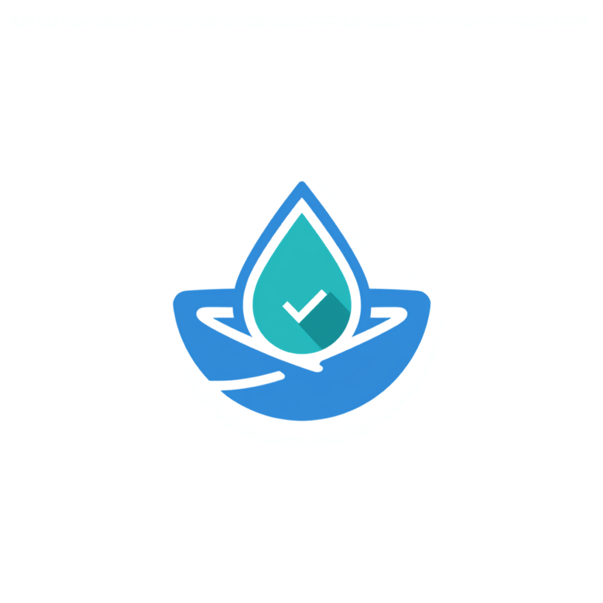
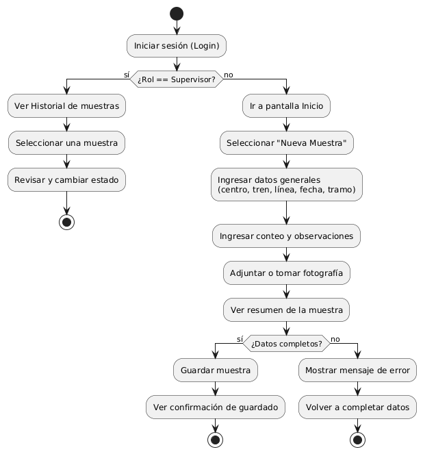

# Acuimuestra

Aplicacion movil para registrar, adjuntar evidencia fotografica y dar trazabilidad a las 
muestras de choritos (mejillones) recolectadas en terreno, desarrollada para el caso 
academico de ALDEMAR SpA.

## Identidad visual

**Paleta de colores:**

| Color | Codigo HEX | Uso |
|---|---|---|
| Principal | #0277BD | Botones de accion principal (Guardar, Confirmar), AppBar |
| Secundario | #00897B | Acentos, iconos activos, navegacion seleccionada |
| Fondo | #F5F7FA | Fondo general de las pantallas |
| Texto | #1B1F23 | Texto principal sobre fondo claro |
| Adicional | #FFB300 | Estados "Observado" o alertas de validacion |

## Flujo de usuario

El siguiente diagrama de actividad UML resume como un operador registra una muestra y como 
un supervisor revisa y valida los registros:

## Pantallas principales

| Pantalla | Descripcion |
|---|---|
| Login | Validar el acceso del usuario segun su rol |
| Inicio | Mostrar accesos segun el rol (operador o supervisor) |
| Nueva Muestra | Registrar datos generales: centro, tren, linea, fecha, tramo |
| Conteo | Registrar el conteo de individuos y observaciones |
| Fotografia | Adjuntar o tomar una fotografia de la muestra |
| Resumen | Confirmar los datos antes de guardar |
| Historial | Consultar y filtrar las muestras registradas |
| Detalle / Revision | Permitir al supervisor cambiar el estado de una muestra |

Las propuestas visuales de cada pantalla estan disponibles en `docs/diseno/interfaces/`.

## Integrantes

- Valentina Santana Guajardo
- Nicol Gonzalez Cobi

## Tecnologias

- Kotlin
- Jetpack Compose
- Room (persistencia local)
- Arquitectura MVVM
- Material Design 3